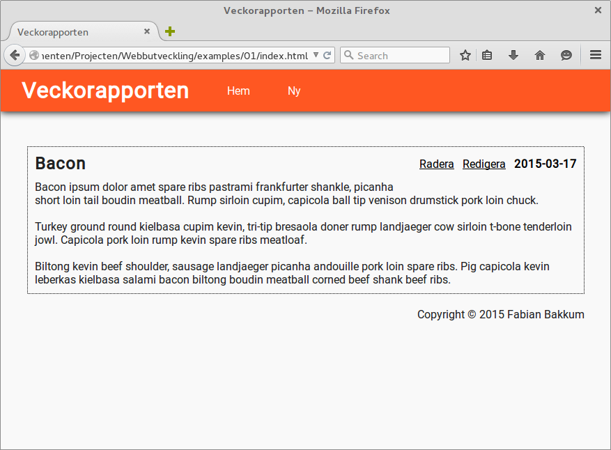

# Cascading Style Sheets

Sidan vi håller på att bygga ser lite tråkig ut. För att få lite färg i det hela måste vi använda oss av CSS. Cascading Style Sheets (CSS) är ett språk för att specificera hur dokumentet ska presenteras till användarna.

Börja med att skapa en ny katalog för kommande uppgift. Skapa en ny fil i den nyss skapade katalogen med namnet `index.html` och en ny katalog med namnet `css` med däri en ny fil kallad `style.css`.

Öppna `index.html` i din favorita texteditor och fyll den med följande grundläggande mall.

```html
<!DOCTYPE html>
<html lang="sv">
<head>
    <meta charset="UTF-8" />
    <title>Exempel på CSS</title>
</head>
<body>
    <h1>Ett exempel på CSS</h1>
    <p><strong>E</strong>n paragraf med text.</p>
    <p class="pretty">En till paragraf med text.</p>
</body>
</html>
```

## Ladda CSS kod

Det finns tre olika sätt på hur man kan ladda CSS:

- **Inline Style Sheet** - Direkt på elementet med hjälp av `style=""` attributet.

- **Embedded Style Sheet** - Genom att inom `head` lägga till `<style type="text/css">` kan man skriva CSS direkt inuti detta element.

- **External Style Sheet** - Ladda ett externt CSS formgivningsblad.

För att ladda ett externt formgivningsblad måste man lägga in följande element i `head`.

`<link href="css/style.css" type="text/css" rel="stylesheet" />`

\newpage

## Hur fungerar CSS?

För att göra texten på sidans titel röd använder vi följande CSS:

```css
h1 { color: red; }
```

Vi börjar med en *selektor*. Det kan vara en tagg, en grupp element eller ett individuellt element. I ovanstående kod använder vi endast `h1` som selektor, vilket gör att alla `h1` rubriker visar upp sig som rödfärgad. Allt inom klammerparentesen kallas för en *deklaration*. Nyckelordet `color` kallas för en *egenskap* och röd är dess *värde*.

```css
selektor { egenskap: "värde"; }
```

Nu har vi använd oss av en tagg selektor, men tänk om vi bara vill formge en paragraf och inte alla? Då kan vi använda oss av ett *class* eller *id* attribut. I regel används *id* endast för att formge ett enda element, medans *class* kan återanvändas på flera ställen.

Prova följande formgivningsblad:

```css
h1 {
    color: red;
}

p {
    color: green;
}

.pretty {
    font-family: sans;
    text-decoration: underline;
    text-align: center;
}

strong {
    color: blue;
    font-size: 28px;
}
```

Rubriken har fått en ny färg, röd och alla paragrafer har blivit grönfärgade. Dock har bara den andra paragrafen fått ett nytt typsnitt, ett understreck och blivit centrerad i mitten. Den andra paragrafen har en class nämnd *pretty*. I formgivningsbladet ser du att det finns en selektor som heter `.pretty`. Till skillnad från de andra regler som bara innehar tagg selektorer så har denna ett punkt framför selektorn. Punkten i namnet tyder på att det är en class selektor. Likadant går att göra med id attributet, dock måste man byta ut punkten mot ett nummertecken.

**Extra uppgift:**

Försök göra sidan så fult som möjligt utan att ändra dokumentstrukturen i HTML filen. Ta hjälp av Mozilla Developer Network för att hitta fler CSS egenskaper som gör sidan ännu fulare.

https://developer.mozilla.org/en-US/docs/Web/CSS/Reference

## Utforma webbapplikationen

Det finns oäntliga många möjligheter med CSS. Dags att använda våra CSS kunskaper för att designa vår webbapplikation. De flesta webbläsare tillämpar sina egna formgivningar. Till exempel så lägger den till stoppning på alla sidor. Vi använder nedanstående CSS för att ta bort stoppningen på alla taggar.

```css
* {
	padding: 0;
	margin: 0;
}
```

Härnäst behöver vi formge bodyn. Där kan man ställa in bakgrundsfärgen samt standard typsnittet och text färgen. Som du ser använder vi, till skillnad från tidigare skriven kod, färgkoder istället. På så sätt kan vi använda oss av alla möjliga färger. Det är viktigt att välja neutrala färger till bakgrunden. Blå bakgrund med röd text blir inte godkänd. Inte bara är det fult, men sidan blir även oanvändbar för färgblinda och personer med nedsatt syn.

```css
body {
    background-color: #F9F9F9;
    font-family: 'Roboto';
    color: #212121;
}
```

Som jag tidigare nämnde, kan man använda en id selektor för att formge ett enda element. Härnedan ser du att vi använder en id selektor, så att vi kan formge menyn. Höjden är satt till 60 pixels och bredden är satt till 100%, alltså lika bred som webbläsarens fönster. Jag la dessutom till en subtil skuggeffekt.

```css
#header-top {
	background-color: #FF5722;
	height: 60px;
	width: 100%;
	box-shadow: 0 1px 10px black;
}
```

För att placera loggan i mitten använder vi oss av padding egenskapen.

```css
#logo {
    font-family: 'Roboto';
    padding-top: 11px;
    padding-left: 30px;
    color: white;
}
```

Eftersom webbläsaren lägger till ett understreck och målar texten blå på länkar behöver vi explicit berätta att den inte ska göra så. Selektorn pekar på länkar inuti `#logo`, men endast på barn till `#logo`. Om du vill att formgivningen även ska tillämpas på barnbarn bör man ta bort större än tecknet.

```css
#logo > a {
    font-family: 'Roboto';
    color: white;
    text-decoration: none;
}
```

Nästa steg är att placera navigationsmenyn på rätt ställe. Eftersom vi vill placera navigationsmenyn inuti `header` menyn, kan vi använda oss av *absolut* positionering. Om man använder sig av *absolute* positionering får man tillgång till top, right, bottom och left egenskaperna.

```css
nav {
    position: absolute;
    top: 21px;
    left: 300px;
}
```
Menyn ser ännu gräslig ut. Knapparna ska presenteras på en enkel rad och punkterna framför ska tas bort i det här fallet.

```css
nav > ul > li {
    display: inline-block;
    list-style-type: none;
}
```

Följande kod gör att knapparna blir vita och skapar ett 25 pixels mellanrum mellan länkarna. Vi tar även bort understrecket med hjälp av `text-decoration` egenskapen.

```css
nav > ul > li > a {
    color: white;
    padding: 0 25px;
    text-decoration: none;
}
```

För att få en fin effekt när vi drar över muspekaren kan man använda sig av en så kallad *pseudo klass*. Här använder vi pseudo klassen *:hover* för att ändra färgen på länkarna då man drar över muspekaren.

```css
nav > ul > li > a:hover {
    color: black;
    padding: 0 25px;
    text-decoration: none;
}
```

Jag gjorde en `div` med identifierare `#page-container`, eftersom vi vill centrera artiklarna på mitten av sidan. Härnedan använder jag en egenskap kallad `max-width` för att begränsa storleken och `margin: auto;` för att centrera allt.

```css
#page-container {
    max-width: 800px;
    height: 100%;
    margin: auto;
    padding-top: 50px;
}
```

Alla artiklar får en kant. Det finns olika mönster, från raka linjer till prickiga. `padding: 10px;` gör att texten inte kläms direkt på kanten och skapar ett 10 pixels mellanrum på alla sidor. `margin-bottom: 20px` skapar ett 20 pixels mellanrum så att man får lite luft mellan alla artiklar.

```css
article {
    border: 1px dotted black;
    padding: 10px;
    margin-bottom: 20px;
}
```

Titeln på artikeln ska visas på den vänstra sidan.

```css
.article-title {
    float: left;
}
```

Knapparna för att ta bort och redigera en artikel ska synas på högra sidan.

```css
.actions {
    float: right;
    text-decoration: none;
    padding-top: 5px;
    color: black;
}
```

Själva artikelns innehåll ska placeras fint under rubriken.

```css
.content {
    padding-top: 10px;
    clear: both;
}
```

Färgen på länkarna ändrar vi till svart.

```css
.actions > a {
    color: black;
}
```

Inläggets datum ska visas i fet text.

```css
.date {
    font-weight: bold;
}
```

Texten i foten, längst ner på sidan, ska rätas upp på högra sidan.

```css
#footer-bottom {
    text-align: right;
}
```

Slutligen måste vi lägga till följande referens i `head` för att få Roboto typsnittet fungerande på datorer som inte har detta typsnitt installerat.

`<link href="http://fonts.googleapis.com/css?family=Roboto" rel="stylesheet" type="text/css" />`

\newpage


