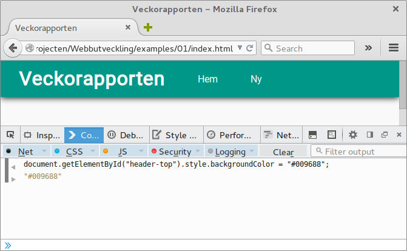

# JavaScript

Nu då sidans skelett och hud är klar måste vi ge den en hjärna. Det går att göra på olika sätt. Antingen använder man en form av client-side skriptning eller server-side skriptning. Det går även att blanda dem två programmeringssätt. Skillnaden mellan dessa två är att med hjälp av server-side skripning genererar man utmatningen på servern och med client-side skriptning händer allt i användarens webbläsare. JavaScript är det språket som finns i alla webbläsare och är världens mest använda programmeringsspråk.

JavaScript är ett språk som utvecklades av Sun Microsystems och Netscape. Eftersom JavaScript var ett egendom från Sun Microsystems, behövde Microsoft utveckla deras eget programmeringsspråk, det blev kallad JScript. European Computer Manufacturers Association (ECMA) gjorde JavaScript till en standard och den standardiserade versionen av JavaScript blev ECMAScript.

ECMA standardiserade endast själva språket och syntaxen, men W3C håller i standarden för webb APIn. JavaScript implementerar ECMAScript. När någon pratar om ECMAScript eller ES6 (version sex av ECMAScript) satsar de oftast på grammatiken. Annars pratar man om JavaScript.

JavaScript tillåter oss skapa mera dynamiska sidor. Med hjälp av JavaScript kan man ändra komponenter på sidan utan att behöva friska upp sidan. För att demonstrera detta kan du öppna en konsol i Firefox med knappkombinationen Ctrl+Shift+K. Följande JavaScript ändrar backgrundsfärgen på vårt meny.

```javascript
var header = document.getElementById("header-top");

header.style.backgroundColor = "#009688";
```


